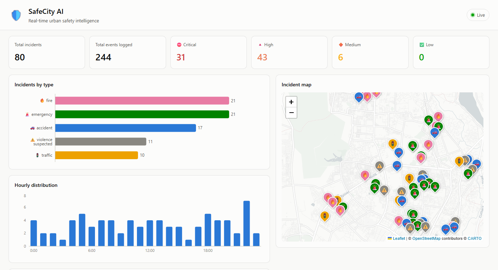
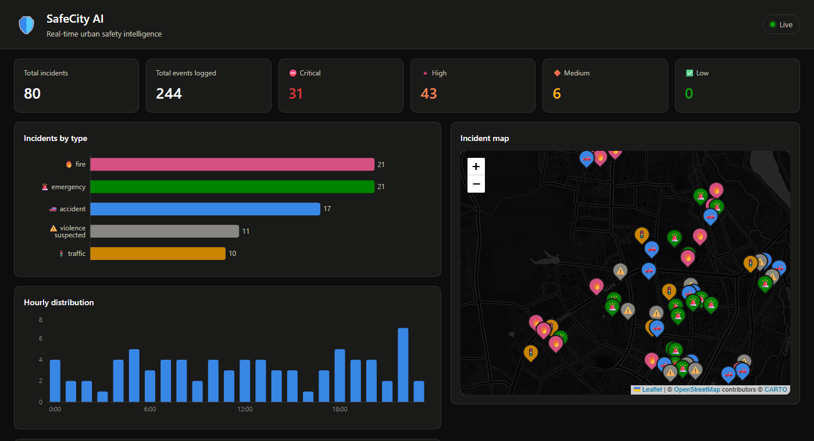
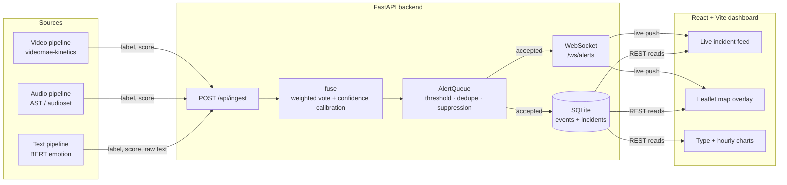

# 🛡️ SafeCity AI

**Real-time urban safety intelligence** — fuses video, audio, and text signals into ranked, deduplicated incident alerts, streamed live to a map-and-feed dashboard.

<p align="center">
  
</p>

<details>
<summary><b>Dark mode</b></summary>
<p align="center">
  
</p>
</details>

---

## What it does

Three independent classifiers (video, audio, text) each look at a piece of evidence and produce a `{label, score}` guess. SafeCity AI's job is what happens next:

1. **Fuse** those per-modality guesses into one incident with a type (`accident`, `fire`, `traffic`, `emergency`, `violence_suspected`) and a confidence score, weighted by how reliable each modality is.
2. **Rank and gate** the result — below a confidence threshold, or a near-duplicate of something just reported, or a repeat of the same alert type within a cooldown window, it's suppressed rather than spammed to responders.
3. **Persist and broadcast** anything that clears the bar, live, to every connected dashboard client.
4. **Visualize** it — a live feed, a color-coded map, incident-type and hourly-distribution charts, and rule-based hotspot/trend forecasting.

## Architecture



The dashboard never talks to the ML models directly — everything flows through `POST /api/ingest`, which accepts already-classified `{label, score}` results (from the pipeline scripts, or replayed historical data) rather than raw files, so the API stays fast and has no ML dependencies at request time.

## Features

- **Multimodal fusion** — per-modality confidence thresholds, sigmoid-calibrated scoring, and a weighted vote (video 0.45 / audio 0.35 / text 0.20) into a single incident type.
- **Alert intelligence** — global score threshold, time-windowed near-duplicate detection (Jaccard text similarity), and per-type suppression cooldowns.
- **Live dashboard** — incident feed, Leaflet map with type-colored + icon-labeled markers, incidents-by-type and hourly-distribution charts, all updating in real time over WebSocket with no page refresh.
- **Forecasting** — hour-of-day risk levels, day-of-week averages, trend direction, and geo-clustered risk zones from historical data.
- **Light/dark theme**, following the OS setting, including map tiles.
- **Accessible color system** — categorical (incident type) and status (severity) colors are validated for colorblind-safe separation and contrast, not eyeballed.

## Tech stack

| Layer | Stack |
|---|---|
| Backend | Python, FastAPI, SQLite (WAL mode), WebSockets |
| ML pipelines | HuggingFace `transformers` (VideoMAE, AST, BERT), PyTorch |
| Frontend | React 19, Vite, Recharts, Leaflet / react-leaflet |
| Map tiles | OpenStreetMap via CARTO (light + dark) |

## Getting started

**Requirements:** Python 3.13, Node 18+.

### Backend
```bash
cd backend
python -m venv .venv && .venv\Scripts\activate.bat   # or your own venv
pip install -r requirements.txt
python seed_demo_data.py   # optional: ~80 sample incidents around Bhubaneswar
python main.py
```
API on `http://localhost:8000` — interactive docs at `/docs`.

### Frontend
```bash
cd frontend
npm install
npm run dev
```
Dashboard on `http://localhost:5173` (dev server proxies `/api` and `/ws` to the backend — no CORS config needed).

### Try live ingestion
```bash
curl -X POST http://localhost:8000/api/ingest \
  -H "Content-Type: application/json" \
  -d '{
    "video": {"label": "car crash", "score": 0.9},
    "text": [{"label": "fear", "score": 0.95, "text": "Major accident on the highway, ambulance requested."}],
    "lat": 20.3541, "lon": 85.8145
  }'
```
Watch it land on the dashboard instantly. Or replay real historical events:
```bash
cd backend
python scripts/replay_events_csv.py
```

## API reference

| Endpoint | Description |
|---|---|
| `GET /api/incidents` | List fused incidents (paginated, filterable by type / min score) |
| `GET /api/incidents/latest` | N most recent incidents |
| `GET /api/events` | Raw per-modality events |
| `GET /api/stats` | Aggregate counts, severity breakdown, hourly distribution |
| `GET /api/forecast` | Hotspot hours, trend, daily averages, risk zones |
| `GET /api/map/incidents` | Geo-tagged incidents for the map |
| `GET /api/config/incident-types` | Type display metadata (color, icon, base severity) |
| `POST /api/ingest` | Submit a video/audio/text result bundle for fusion + alerting |
| `WS /ws/alerts` | Live push of accepted incidents |

## Project structure

```
backend/
  main.py              FastAPI app + WebSocket route
  api/routes.py         REST endpoints + POST /api/ingest
  core/
    fusion.py            weighted multimodal voting
    alerts.py             AlertQueue: threshold, dedupe, suppression
    forecast.py            rule-based hotspot/trend analysis
    db.py                    SQLite read/write
    config.py                 all tunables: weights, thresholds, label maps, colors
  pipelines/            standalone video/audio/text/summarization classifiers
  scripts/replay_events_csv.py   dry-run ingestion against historical data
  seed_demo_data.py     synthetic demo dataset generator

frontend/
  src/
    api.js               REST client + incident normalization
    theme.js              validated color palette
    hooks/useLiveAlerts.js  WebSocket connection with auto-reconnect
    components/            Header, StatTiles, charts, MapView, IncidentFeed, Filters
```

## Known limitations

- The video model (Kinetics-400 action recognition) has no concept of "accident" or "emergency" — those incident types are currently only reachable via audio/text corroboration, not video alone.
- No authentication on `/api/ingest` or CORS restriction — fine for local development, not for exposing beyond localhost as-is.
- Forecasting is descriptive statistics (hour-of-day histograms, simple trend comparison), not a trained model.
- No automated test suite yet.

See [`CLAUDE.md`](CLAUDE.md) for the full architectural deep-dive and [`findings.md`](findings.md) for the project's development history and design decisions.
